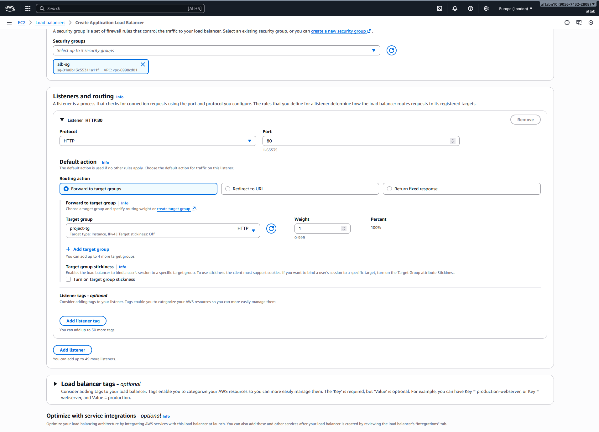
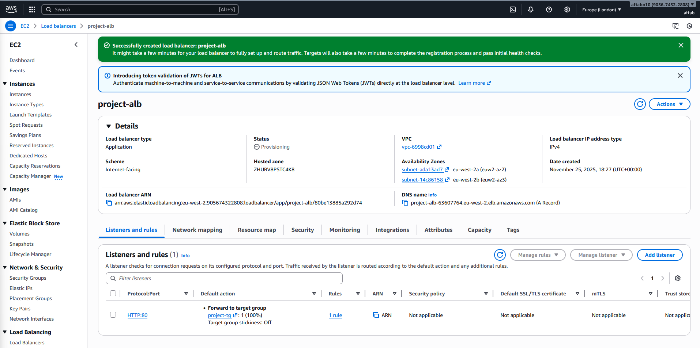
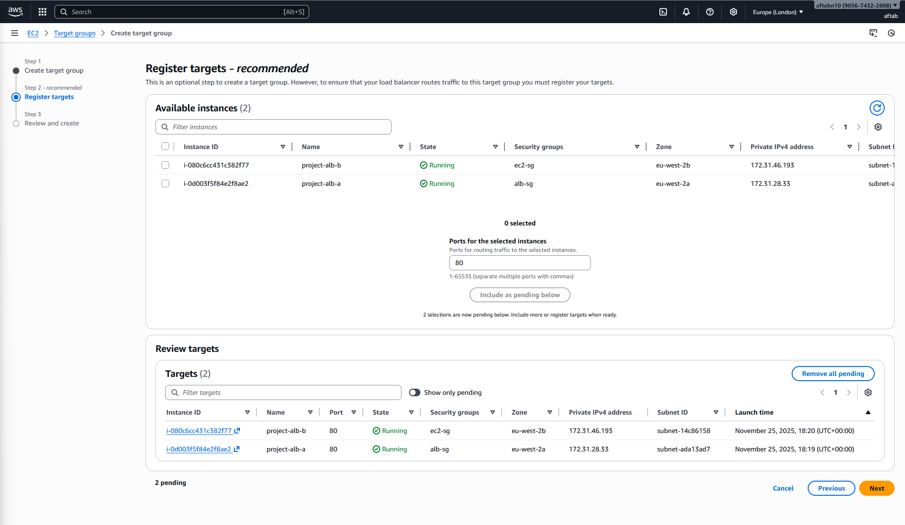
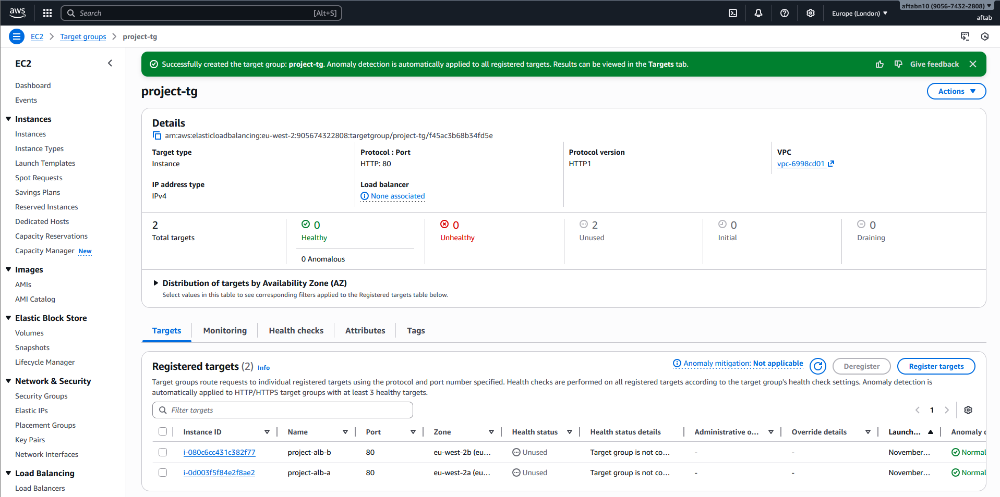
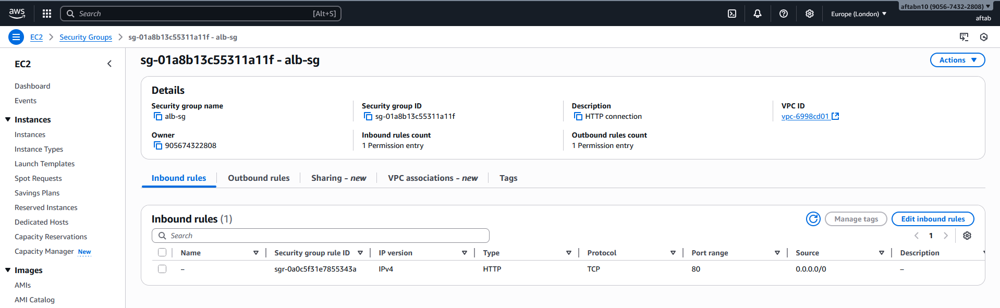
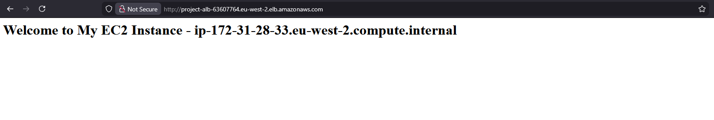
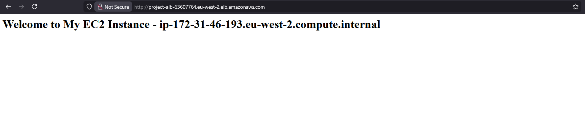
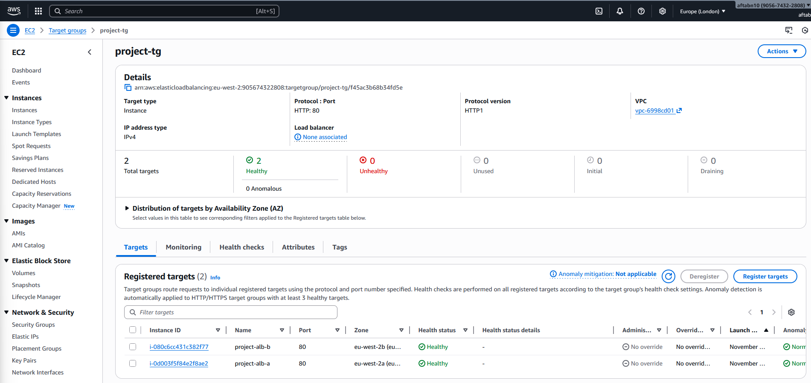

# AWS Networking Assignment:

# Introduction

A common DevOps pattern: multiple EC2 instances behind an ALB. This teaches load balancing, health checks, and proper security group isolation.

## Step by Step

**Task 1: Two EC2 Instances**

- Launch **two EC2 instances** in the same VPC.
    
- Place them in **different Availability Zones** for redundancy.
    
- Use **User Data** to install Apache and serve a simple web page.

```
#!/bin/bash
yum update -y
yum install -y httpd

systemctl start httpd
systemctl enable httpd

echo "<h1>Welcome to My EC2 Instance - $(hostname -f)</h1>" > /var/www/html/index.html
```
    
- Ensure each instance returns **different content** (e.g., hostname or instance ID) for testing.
    

📸 _Screenshot: EC2 instances list in AWS console_ 


📸 _Screenshot: User data script used at launch_ 


📸 _Screenshot: Instance public IP showing unique content in browser_


---

**Task 2: Set Up the ALB**

- Create an **Application Load Balancer** in **two public subnets**.
    
- Add an **HTTP listener (port 80)**.
    
- Create a **Target Group** (HTTP, port 80).
    
- Register both EC2 instances with the target group.
    
- Configure a **health check** on path `/`.
    

📸 _Screenshot: ALB creation wizard_





📸 _Screenshot: Target group with registered instances_ 




📸 _Screenshot: Health check configuration_


---

**Task 3: Security Groups**

- **ALB Security Group**: allow inbound HTTP (port 80) from anywhere.
    
- **EC2 Security Group**: allow inbound HTTP only from the ALB SG.
    
- Do **not** allow direct public access to EC2 instances.
    

📸 _Screenshot: ALB SG inbound rules_ 


📸 _Screenshot: EC2 SG inbound rules referencing ALB SG_


---
### Task 4: Testing

- Visit the **ALB DNS name** in your browser.
    
- Refresh multiple times to verify traffic alternates between both instances.
    
- Confirm **health checks** show both instances as healthy.
    
- Verify direct access to EC2 public IPs fails once SGs are locked down.
    

📸 _Screenshot: Browser showing alternating responses_




📸 _Screenshot: Target group health status (healthy)_
