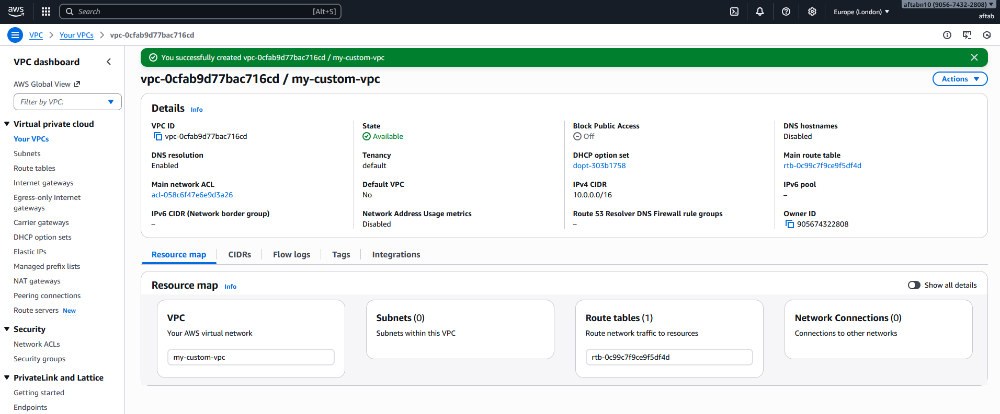
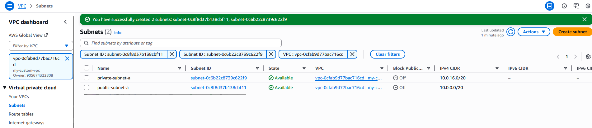
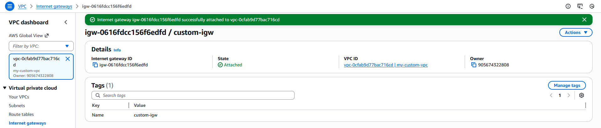
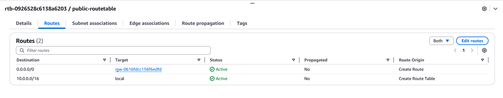
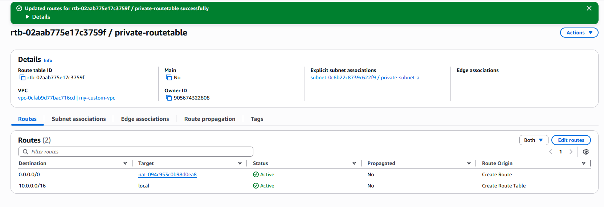
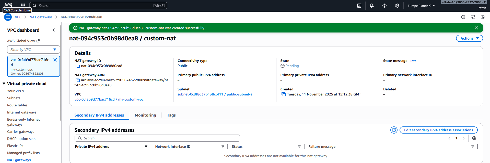
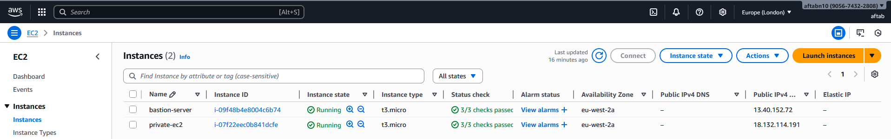

# AWS Networking Assignment: VPC and Network Setup

## Introduction
This project demonstrates the configuration of a custom Virtual Private Cloud (VPC) environment in AWS designed for secure and scalable deployments.  
The implementation includes both public and private subnets, internet connectivity through an Internet Gateway (IGW) and NAT Gateway (NGW), and EC2 instances configured with proper network segmentation and routing.

The setup follows a standard two-tier architecture pattern where:
- The **public subnet** hosts internet-facing resources such as a bastion host or web server.
- The **private subnet** hosts internal resources without direct public internet access.
- Secure access is achieved through controlled routing and security group configurations.

---

## Summary of Configuration

| Component            | Configuration Details                                                                 |
|----------------------|----------------------------------------------------------------------------------------|
| **VPC**              | Custom VPC created with CIDR block `10.0.0.0/16`                                      |
| **Public Subnet**    | `10.0.1.0/24` — Allows public internet access via IGW                                 |
| **Private Subnet**   | `10.0.2.0/24` — Internal network, outbound access via NAT Gateway                     |
| **Internet Gateway** | Attached to VPC for external connectivity                                             |
| **NAT Gateway**      | Deployed in Public Subnet with Elastic IP for Private Subnet outbound access           |
| **Route Tables**     | Public: IGW route `0.0.0.0/0`; Private: NAT route `0.0.0.0/0`                         |
| **EC2 Instance (Public)** | Bastion Host with public IP — SSH access allowed from trusted IPs only          |
| **EC2 Instance (Private)** | Internal instance with no public IP — accessible only via Bastion Host         |
| **Availability Zone**| Both subnets created in same AZ for simplicity                                        |
| **Security Groups**  | Configured to restrict inbound access and allow controlled SSH between instances       |

---

## Steps and Configuration Details

### 1. Create the VPC
- **CIDR Block:** `10.0.0.0/16`
- **DNS Resolution:** Enabled  
- **DNS Hostnames:** Disabled  
- This forms the foundational virtual network environment for all subsequent components.

**Screenshot:**

---

### 2. Create Subnets
- **Public Subnet:** `10.0.0.0/20`  
  - Hosts resources that require internet access.
  - Configured to auto-assign public IPs.
- **Private Subnet:** `10.0.16.0/20`  
  - Hosts internal resources that do not require direct internet access.

Both subnets were created within the same Availability Zone for simplicity and cost efficiency.

**Screenshot:**

---

### 3. Create and Attach Internet Gateway (IGW)
- Created an **Internet Gateway** and attached it to the custom VPC.
- This enables outbound and inbound internet connectivity for the public subnet.

**Screenshot:**

---

### 4. Create Route Tables
Two separate route tables were configured:

- **Public Route Table**
  - Routes:  
    - `10.0.0.0/16` → Local  
    - `0.0.0.0/0` → Internet Gateway  
  - Associated with the **Public Subnet**.

**Screenshot:**

- **Private Route Table**
  - Routes:  
    - `10.0.0.0/16` → Local  
    - `0.0.0.0/0` → NAT Gateway  
  - Associated with the **Private Subnet**.

**Screenshot:**

---

### 5. Create NAT Gateway (NGW)
- Deployed in the **Public Subnet**.
- Allocated and attached an **Elastic IP**.
- Allows instances in the private subnet to initiate outbound connections to the internet securely.

**Screenshot:**

---

### 6. Launch EC2 Instances
- **Public Subnet Instance:**  
  - Deployed with a public IP and configured as a **bastion host** for secure SSH access.
  
- **Private Subnet Instance:**  
  - Deployed without a public IP.
  - Accessible only through the bastion host in the public subnet.

**Screenshot:**

### 7. CloudWatch Monitoring & Logging

- ** NOT DEPLOYED **

---

## What I Learned

- Gained a clearer understanding of how **VPCs** define isolated network environments within AWS.  
- Learned how to design and allocate **CIDR blocks** for efficient subnet planning.  
- Practiced creating both **public and private subnets** and assigning the correct routing for each.  
- Configured and attached an **Internet Gateway (IGW)** to enable public internet access.  
- Deployed and tested a **NAT Gateway (NGW)** to allow private resources secure outbound connectivity.  
- Set up and managed **route tables** to control traffic flow between subnets and external networks.  
- Launched **EC2 instances** in both subnets, understanding how IP addressing and connectivity differ between them.  
- Implemented a **bastion host** to securely access private instances without exposing them publicly.  
- Strengthened awareness of **security best practices** using Security Groups and controlled SSH access.  
- Developed a more practical understanding of how AWS networking components integrate to form scalable, secure architectures.

